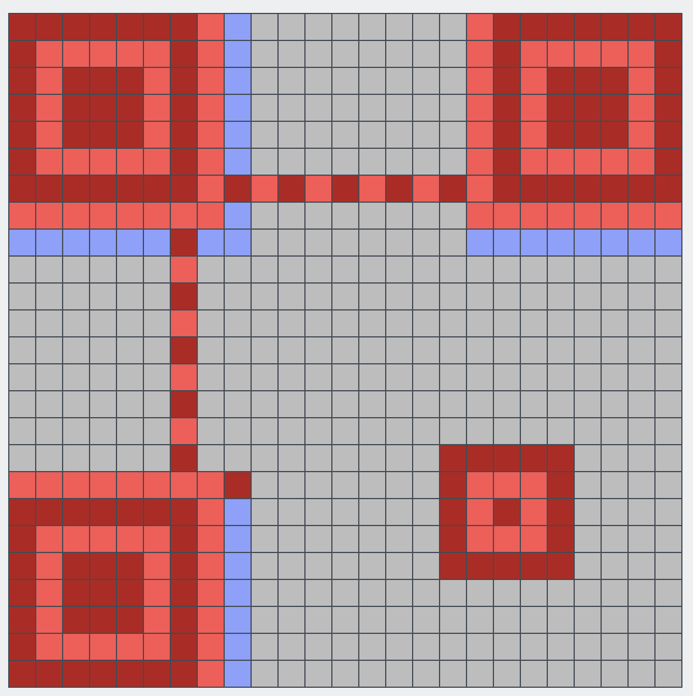
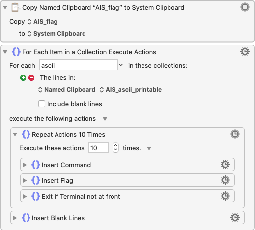

# AIS3 2020 PreExam Write Up

For English version, see [README](./README.md)

人生中第一場CTF，解了10題，看了很多前輩寫的Write Up，讓我獲益良多，解了不少題目，所以比賽還沒結束我就想好要寫這份Write Up了，希望可以幫助新來的菜鳥。也感謝所有的出題TA，~~讓我撿了不少水題~~。

[TOC]

以下整理這次的題目，有連結的就是有解題思路，有Flag的，就是我有~~賽到~~解出來的題目
## 題目列表

| 分類      | 題目                   | 最後分數 | 解題成功 | Flag                                                         |
| --------- | ---------------------- | -------- | -------- | ------------------------------------------------------------ |
| 🐧 Misc    | 💤 Piquero              | 100      | 347      | `AIS3{I_feel_sleepy_Good_Night!!!}`                          |
| 🐧 Misc    | 🐥 Karuego              | 100      | 245      | `AIS3{Ar3_y0u_r34l1y_r34dy_t0_sumnn0n_4_D3m0n?}`             |
| 🐧 Misc    | 🌱 Soy                  | 139      | 172      | `AIS3{H0w_c4n_y0u_f1nd_me?!?!?!!}`                           |
| 🐧 Misc    | 👑 Saburo               | 359      | 108      | `AIS3{A1r1ght_U_4r3_my_3n3nnies}`                            |
| 🐧 Misc    | 👿 Shichirou            | 450      | 65       |                                                              |
| 🐧 Misc    | 🧸 Clara                | 500      | 2        |                                                              |
| ♻️ Reverse | 🍍 TsaiBro              | 100      | 281      |                                                              |
| ♻️ Reverse | 🎹 Fallen Beat          | 144      | 171      | `AIS3{Wow_how_m4ny_h4nds_do_you_h4ve}`                       |
| ♻️ Reverse | 🧠 Stand up!Brain       | 455      | 62       |                                                              |
| ♻️ Reverse | 🍹 Long Island Iced Tea | 498      | 15       |                                                              |
| ♻️ Reverse | 🌹 La vie en rose       | 499      | 12       |                                                              |
| ♻️ Reverse | 🐉 Uroboros             | 500      | 9        |                                                              |
| 💥 Pwn     | 👻 BOF                  | 100      | 189      |                                                              |
| 💥 Pwn     | 📃 Nonsense             | 474      | 47       |                                                              |
| 💥 Pwn     | 🔫 Portal gun           | 491      | 28       |                                                              |
| 💥 Pwn     | 🏫 Morty school         | 498      | 14       |                                                              |
| 💥 Pwn     | 🔮 Death crystal        | 499      | 10       |                                                              |
| 💥 Pwn     | 📦 Meeseeks box         | 500      | 8        |                                                              |
| 🙊 Crypto  | 🦕 Brontosaurus         | 100      | 380      | `AIS3{Br0n7Os4uru5_ch3at_3asi1Y}`                            |
| 🙊 Crypto  | 🦖 T-Rex                | 100      | 381      | `AIS3{TYR4NN0S4URU5_R3X_GIV3_Y0U_SOMETHING_RANDOM_5TD6XQIVN3H7EUF8ODET4T3H907HUC69L6LTSH4KN3EURN49BIOUY6HBFCVJRZP0O83FWM0Z59IISJ5A2VFQG1QJ0LECYLA0A1UYIHTIIT1IWH0JX4T3ZJ1KSBRM9GED63CJVBQHQORVEJZELUJW5UG78B9PP1SIRM1IF500H52USDPIVRK7VGZULBO3RRE1OLNGNALX}` |
| 🙊 Crypto  | 🐙 Octopus              | 372      | 103      |                                                              |
| 🙊 Crypto  | 🐡 Blowfish             | 480      | 42       |                                                              |
| 🙊 Crypto  | 🐪 Camel                | 497      | 18       |                                                              |
| 🙊 Crypto  | 🐢 Turtle               | 498      | 14       |                                                              |
| 🌐 Web     | 🐿️ Squirrel             | 100      | 220      |                                                              |
| 🌐 Web     | 🦈 Shark                | 100      | 261      | `AIS3{5h4rk5_d0n'7_5w1m_b4ckw4rd5}`                          |
| 🌐 Web     | 🐘 Elephant             | 168      | 165      | `AIS3{0nly_3l3ph4n75_5h0uld_0wn_1v0ry}`                      |
| 🌐 Web     | 🐍 Snake                | 272      | 137      | `AIS3{7h3_5n4k3_w1ll_4lw4y5_b173_b4ck.}`                     |
| 🌐 Web     | 🦉 Owl                  | 492      | 27       |                                                              |
| 🌐 Web     | 🦏 Rhino                | 494      | 24       |                                                              |

## 🐧 Misc

### 💤 Piquero


如果你搭電梯真的很無聊，你對這題一定特別有想法 (X

反正就是點字 (Braille)，翻譯一下就出來了

要注意的就是 大寫英文、數字和標點前面會多一方標註

但查表可能很難查/查不到，所以我是解完其他題之後用腦補的方式猜完中間的標點

另外我發現一個小技巧，比方說要查 `⠸` 這個4 5 6有點的你可以直接打英文維基的網址

https://en.wikipedia.org/wiki/Braille_pattern_dots-456

裡面就會列出他在不同語言代表的意思

Flag：`AIS3{I_feel_sleepy_Good_Night!!!}`

### 🐥 Karuego


這個是一張png的圖片，flag就藏在這個裡面

用`binwalk`把壓在裡面的壓縮檔解出來

```bash
binwalk -e Karuego_0d9f4a9262326e0150272debfd4418aaa600ffe4.png
```

再用`zsteg`獲得壓縮檔的密碼

```bash
$ zsteg Karuego_0d9f4a9262326e0150272debfd4418aaa600ffe4.png
[?] 1201353 bytes of extra data after image end (IEND), offset = 0x1f6d30
extradata:0         .. file: Zip archive data, at least v1.0 to extract
    00000000: 50 4b 03 04 0a 00 00 00  00 00 40 8a bd 50 00 00  |PK........@..P..|
    00000010: 00 00 00 00 00 00 00 00  00 00 06 00 1c 00 66 69  |..............fi|
    00000020: 6c 65 73 2f 55 54 09 00  03 47 d3 d0 5e ed d3 d0  |les/UT...G..^...|
    00000030: 5e 75 78 0b 00 01 04 f5  01 00 00 04 14 00 00 00  |^ux.............|
    00000040: 50 4b 03 04 14 00 09 00  08 00 6f 21 07 49 ac 2c  |PK........o!.I.,|
    00000050: 71 1f 7c b9 01 00 d6 b9  01 00 35 00 1c 00 66 69  |q.|.......5...fi|
    00000060: 6c 65 73 2f 33 61 36 36  66 61 35 38 38 37 62 63  |les/3a66fa5887bc|
    00000070: 62 37 34 30 34 33 38 66  31 66 62 34 39 66 37 38  |b740438f1fb49f78|
    00000080: 35 36 39 63 62 35 36 65  39 32 33 33 5f 68 71 2e  |569cb56e9233_hq.|
    00000090: 6a 70 67 55 54 09 00 03  71 44 a6 57 48 d3 d0 5e  |jpgUT...qD.WH..^|
    000000a0: 75 78 0b 00 01 04 f5 01  00 00 04 14 00 00 00 1d  |ux..............|
    000000b0: cd 40 aa 87 37 8a 57 93  85 a9 4c b3 cf fd 58 2d  |.@..7.W...L...X-|
    000000c0: 38 10 a2 2a dc 61 3e 8a  67 bf 4c c1 e1 cb d0 d0  |8..*.a>.g.L.....|
    000000d0: 32 65 97 d0 b5 ef f0 a5  2a 04 a6 00 af b2 63 e9  |2e......*.....c.|
    000000e0: 19 c2 6a 7b de 79 a3 a2  3f 0a b3 e8 74 67 35 ec  |..j{.y..?...tg5.|
    000000f0: 1b 8b 90 c9 76 30 ad ab  18 7a e9 9a ed f7 8e 7c  |....v0...z.....||
b1,rgb,lsb,xy       .. text: "The key is : lafire"
b1,bgr,lsb,xy       .. <wbStego size=865108, data=";M\xCD!,\xC5\xA0:\x807"..., even=false, enc="wbStego 2.x/3.x", controlbyte="\x80">
b3,r,lsb,xy         .. file: gfxboot compiled html help file
b3,bgr,msb,xy       .. file: Applesoft BASIC program data, first line number 2
b4,r,lsb,xy         .. file: PDP-11 UNIX/RT ldp
b4,g,lsb,xy         .. file: a.out VAX demand paged (first page unmapped) pure executable not stripped
b4,b,lsb,xy         .. file: Targa image data - Map 16 x 4096 x 16 +16 +4353 ""
b4,rgb,lsb,xy       .. file: Targa image data - Map (256-4112) 4096 x 65536 x 1 +4097 +257 - right ""
b4,bgr,lsb,xy       .. file: PDP-11 UNIX/RT ldp
```

可以看到密碼是`lafire`，解開壓縮檔，裡面的圖片就有flag了

至於上面這堆東西我是怎麼想到的，簡單來說是Google，更準確的說就是Google `CTF 圖片`，第一筆就是了

小心英文小寫`l`和數字`1`，看了好久QQ

Flag：`AIS3{Ar3_y0u_r34l1y_r34dy_t0_sumnn0n_4_D3m0n?}`

### 🌱 Soy


修復QR Code，對QR Code有一些基礎的了解是很有幫助的

比方說下面這張空的QR Code



紅色的是固定的定位標記，藍色的是[Format Info](https://zh.wikipedia.org/wiki/QR%E7%A2%BC#%E7%BB%93%E6%9E%84)

我是使用[QRazyBox](https://merricx.github.io/qrazybox/)這個工具修復的，點擊藍藍色的區域會列出所有可能的格式

跟題目的QR Code對照，可以找到Error Correction Level: `L`，Mask Pattern: `0`是唯一的可能解

接下來把題目剩下的格子一個一個填進去，解到一定的程度之後就可以掃的出來了


Flag：`AIS3{H0w_c4n_y0u_f1nd_me?!?!?!!}`

### 👑 Saburo


這題一開始我本來也是沒什麼想法

頂多就是發現輸入`AIS3{`可以得到比其他隨機的input來得高一點的延遲

雖然有點頭緒了，但這種暴力解題實在是太白痴

所以我後來是先放著去解其他題

直到第二天晚上，我發現很多人在Discord聊天群上抱怨這一題的秒數很跳

然後才意識到，嗯 看起來我的方向應該是沒有錯：）

反正~~水題~~會的題目也解的差不多了，那就來硬幹這一題吧呵呵

我原本的想法是 用Python寫一個腳本

迭代所有ASCII Pritable的字，抓秒數最大的，然後重複到下大括號出現就是完整解碼了

大致上就是下面醬

```python
s = socket.socket(socket.AF_INET, socket.SOCK_STREAM)
s.connect(("60.250.197.227", 11001))
s.send(b"\n");
s.send(input(s.recv(1024).strip().decode()).encode())
print(s.recv(1024).strip().decode())
```

可是不管我怎麼調，他的秒數不會像在Terminal裡面一樣加上去

事到如今，只能把他改成Shell Script了

可是，好難~~，而且這學期的Unix也沒教~~

於是絕望之際，我有一個大膽的想法



如果沒用過的，這個叫按鍵精靈

基本上就是把一系列的鍵盤操作預錄成腳本然後自動執行

我是用Mac的Keyboard Maestro，但我相信其他按鍵精靈也可以輕鬆達到類似的效果

Flag：`AIS3{A1r1ght_U_4r3_my_3n3nnies}`

